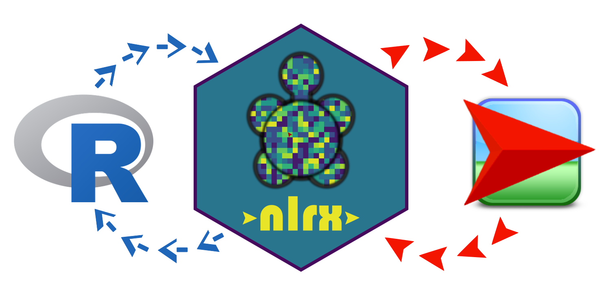
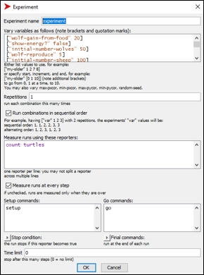

```{r setup, include=FALSE}
knitr::opts_chunk$set(echo = FALSE)
```


## The nlrx R package: A next‐generation framework for reproducible NetLogo model analyses
<center><br>
https://github.com/ropensci/nlrx

Jan Salecker <font size="3">jsaleck@gwdg.de</font>, Marco Sciaini <font size="3">msciain@gwdg.de</font>,<br>
Katrin M. Meyer <font size="3">kmeyer5@gwdg.de</font>, Kerstin Wiegand <font size="3">kwiegan@gwdg.de</font>
</center>


## Motivation

Agent-based models are often complex and multidimensional

Typical model analyses, such as

- parameter screenings
- sensitivity analysis
- Population viability analysis

... often require many runs with hundreds of different parameter combinations and a high computational effort!


## Existing Tools


Some NetLogo tools already exist, each with its own caveats: 

- NetLogo GUI /NetLogo Code
    - Not efficient
- NetLogo BehaviorSpace
    - Limitations
- BehaviorSearch
    - Only optimization
- RNetLogo (+ nlexperiment)
    - rJava issues
    - Setup needs lots of code

## nlrx features

- Run experiments directly from R
- Reproducible workflow
- Easy setup
- Intuitive and simple workflow
- Many experiment setup methods already builtin
- Setup methods can be easily extended with own methods
- Basic output analysis functions available for most experiment setup methods
- Supports parallelisation, even on remote HPC machines

## nlrx availability

- Install via CRAN: <br>`install.packages("nlrx")`
- Install via github: <br>`devtools::install_github("ropensci/nlrx")`
- Online documentation: <br>https://github.com/ropensci/nlrx <br> https://ropensci.github.io/nlrx/
- Methods in Ecology and Evolution publication: <br>https://doi.org/10.1111/2041-210X.13286

## nlrx workflow

<center></center>

<font size="2">Salecker et al. 2019</font>

## Simdesign examples

<center></center>

## Performance

<center></center>

<font size="2">Salecker et al. 2019</font>

## Analysis Example I - Sensitivity Analysis

<center></center>

<font size="2">Salecker et al. 2019</font>

## Analysis Example II - Genetic Algorithm

<center></center>

<font size="2">Salecker et al. 2019</font>

## Visualization examples I

- nlrx is also useful to collect agent related spatial data
- such data can be used to create animated figures with enhanced visualization options (ggplot2, gganimate)

  

## Visualization examples II

<center></center>

## Contribute

- Please report bugs and problems at our github
- We are also very open to contributions and ideas to improve nlrx further

- Big thanks to rOpenSci for reviewing and hosting our package!


## Questions?
<center><br>
https://github.com/ropensci/nlrx

Jan Salecker <font size="3">jsaleck@gwdg.de</font>, Marco Sciaini <font size="3">msciain@gwdg.de</font>,<br>
Katrin M. Meyer <font size="3">kmeyer5@gwdg.de</font>, Kerstin Wiegand <font size="3">kwiegan@gwdg.de</font>
</center>


