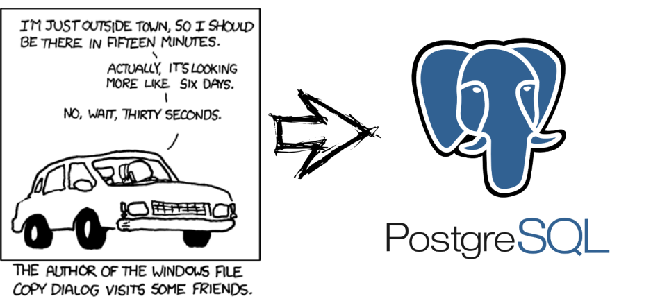
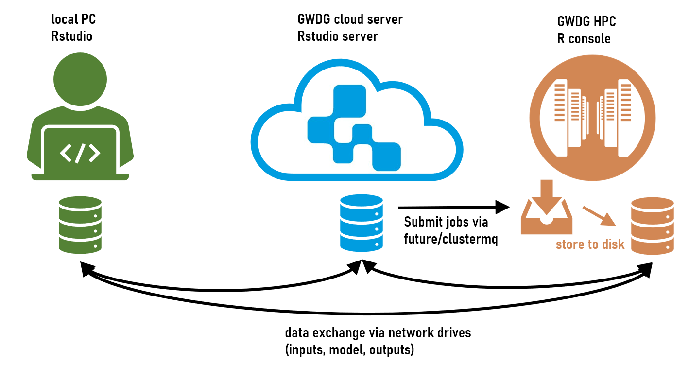
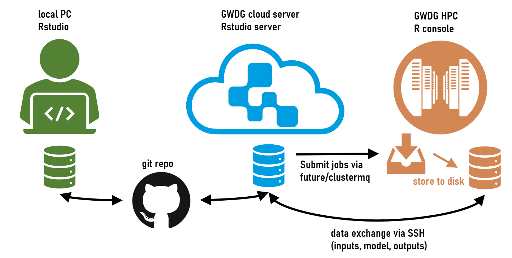
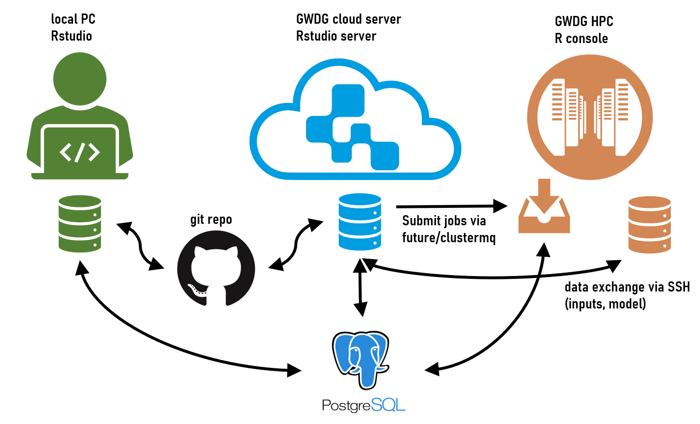

```{r setup, include=FALSE}
knitr::opts_chunk$set(echo = FALSE)
```


## There is an elephant in the room...

{width=90%}


# Motivation

## Motivation

My current R workflow consists of:

- Local desktop/laptop 
    - Daily work
    - Development of scripts, analyses
    - Post-processing of simulation results
    - Writing papers (RMarkdown)
- GWDG Cloud server running RStudio Server
    - Conducting heavy load simulation jobs
    - Submitting jobs to the GWDG HPC
- GWDG HPC
    - Only executes simulations sent from the cloud server


## Route to SQL step 1: The Ignorant

{width=90%}

## Route to SQL step 2: The educated

{width=90%}


## Route to SQL step 3: The sophisticated

{width=90%}


## Lessons learned

- manual copying is bad and error-prone
- github enables reliable file transfer between local PC and cloud server
- ssh enables convenient file transfer between cloud server and HPC

But:

- big data cannot be transfered via github or SSH
- handling thousands of *.rds files is cumbersome

SQL database is a great addition to manage file transfer between all three instances of R, especially for big data

## SQL

- not as powerful as Apache hadoop but adequate for our purposes
- database based on tables
    - relates well to data.frames / tibbles / data.tables
- R packages allow easy access to SQL databases, even remotely

PostgreSQL

- open-source version of SQL
- easy to setup/access
- unlimited database size & unlimited rows per table
- maximum table size of 32 TB
- maximum cell size og 1 GB

# How to setup PostgreSQL


## How to setup PostgreSQL

I have installed the PostgreSQL server on my GWDG cloud server because it is available 24/7.

I used this detailed guide on how to install the postgresql server:

https://wiki.ubuntuusers.de/PostgreSQL/

Afterwards some configuration needs to be done...


## Remote access

Step 1: Open SQL communication port

- Open port 5432 on GWDG cloud server (GWDG services)

Step 2: Edit postgresql.conf file:

- `sudo nano /etc/postgresql/xx/main/postgresql.conf` (exchange xx with version number)
- Change line `listen_addresses='localhost'` to `listen_addresses='*'`


## Remote access

Step 3: Edit `hba_file`:

In order to find location of `hba_file` log into postgresql:

- `sudo -u postgres psql`
- then type `SHOW hba_file;` and copy the path (e.g. /etc/postgresql/12/main/pg_hba.conf)
- close postgresql: `\q`
- edit the file: `sudo nano /etc/postgresql/12/main/pg_hba.conf`


## Remote access

- Original settings of pg_hba.conf:
```
# local   replication     all                                     peer
# host    replication     all             127.0.0.1/32            md5
# host    replication     all             ::1/128                 md5
```
- change `replication` to `all`
- change ip4 host to `0.0.0.0/0`
- change ip6 host to `::0/0`
- Then restart postgresql `sudo /etc/init.d/postgresql restart`


## Configure SQL database:

Some important terminal commands:

- stop/restart/start:
    - `sudo /etc/init.d/postgresql restart`
    - `sudo /etc/init.d/postgresql stop`
    - `sudo /etc/init.d/postgresql start`

- Create/remove user:
    - `sudo -u postgres createuser -P -d NUTZERNAME`
    - `sudo -u postgres dropuser NUTZERNAME`

## Configure SQL database:

Some important terminal commands:

- Create/remove database (each user can have multiple databases):
    - `sudo -u postgres createdb -O NUTZERNAME DATENBANK`
    - `sudo -u postgres dropdb DATENBANK`

- Connect into database locally from terminal:
    - choose user/database: `psql -d smnws -U NUTZERNAME`
    - as admin user: `sudo -u postgres psql`


## How to use PostgreSQL from R

- The R packages `RPostgres` and `DBI` allow to access SQL databases
- Assuming we have setup a user account (`jan`) and a database (`projectXY`) we can setup a connection:

```{r eval=FALSE, echo=TRUE}
library(RPostgres)
library(DBI)
con <- dbConnect(RPostgres::Postgres(),
                 dbname = 'projectXY', 
                 port = 5432, 
                 user = 'jan',
                 password = 'xyz')
```

## How to use PostgreSQL from R

```{r eval=FALSE, echo=TRUE}
# Print tables in db (each database can have multiple tables):
dbListTables(con) 

# Write tables to db:
dbWriteTable(con, "mtcars", mtcars)

# Read tables from db:
dbReadTable(con, "mtcars")

# Modify tables:
newlines <- data.frame(mpg=99, cyl=99, disp=99, hp=99, drat=99, wt=99, qsec=99, vs=99, am=99, gear=99, carb=99)
dbAppendTable(con, "mtcars", newlines)
dbReadTable(con, "mtcars")

# Delete tables:
dbRemoveTable(con, "mtcars")

# Disconnet:
dbDisconnect(con)
```

## Remote access

When remote access is configured correctly (see above) you can enter the remote host in the connection (in my case the IP address of my GWDG cloud server):

```{r eval=FALSE, echo=TRUE}
con <- dbConnect(RPostgres::Postgres(),
                 dbname = 'projectXY', 
                 host = "141.5.105.225", 
                 port = 5432, 
                 user = 'jan',
                 password = 'xyz')
dbListTables(con) 
dbDisconnect(con)
```

## Write SQL tables in parallel

- I want to fill up an empty table from the HPC in parallel
- To do this, the table need to exist in advance
- Thus, before submitting my jobs I create an empty tibble to initialize the table

```{r echo = TRUE}
 results_template <- tibble::tibble(name=character(), value=numeric())
results_template
```                                    
```{r eval=FALSE, echo=TRUE}
 dbWriteTable(con, 
              "tablename", 
              results_template, 
              overwrite=TRUE)  
  
```

## Fill up table in parallel

- We can then use a function that writes directly to that table

```{r eval=FALSE, echo=TRUE}
simfun <- function(x, con, tablename)
{
  # Output (probably another function is called to do something meaningful)
  out <- tibble::tibble(name=x, value=x)
  
  # append data
  dbAppendTable(con, "tablename", out)
  
  # close connection
  dbDisconnect(con)
  
  # Return nothing
  return()
}
```

# Intermission: File tranfser via SSH

## File transfer via SSH

```{r eval=FALSE, echo=TRUE}
hpc.upload <- function (from = NA, to = NA, user = NA, 
                        host = "transfer.gwdg.de", key = NA) 
{
  session <- ssh::ssh_connect(paste0(user, "@", host), keyfile = key)
  ssh::scp_upload(session, files = from, to = to)
  ssh::ssh_disconnect(session)
}
```
```{r eval=FALSE, echo=TRUE}
hpc.download <- function (from = NA, to = NA, user = NA, 
                          host = "transfer.gwdg.de", key = NA) 
{
  session <- ssh::ssh_connect(paste0(user, "@", host), keyfile = key)
  ssh::scp_download(session, files = from, to = to)
  ssh::ssh_disconnect(session)
}
``` 

## File transfer via SSH

```{r eval=FALSE, echo=TRUE}
hpc.delete <- function (folder = NA, user = NA, 
                        host = "transfer.gwdg.de", key = NA) 
{
  session <- ssh::ssh_connect(paste0(user, "@", host), keyfile = key)
  ssh::ssh_exec_wait(session, 
                     command = paste0("find ", 
                                      folder, 
                                      "/ -maxdepth 1 -type f -delete"))
  ssh::ssh_disconnect(session)
}
```


# A complete workflow example

## Introduction

- I want to use EFForTS-ABM as an example how my workflow looks at the moment
- Lets imagine I start by implementing a new feature into EFForTS-ABM
- Afterwards I want to run some analyses on the HPC

## Step 01

- Local PC
    - Implement features in NetLogo
    - Prepare analysis scripts 
    - Do some test runs
    - Push everything to the github repo

## Step 02

- Cloud server
    - Pull the changes
    - Send model files and inputs to HPC via SSH
    - Prepare empty SQL table (dbwriteTable, overwrite=TRUE)
    - Execute Q function to start HPC jobs

- Log into HPC terminal to inspect job status
    - Once all jobs are finished, proceed
    
## Step 03

- Cloudserver
    - Load results from SQL table (dbreadtable)
    - Attach results tibble to nl object
    - Store complete nl object as *.rds
    - Push to git repo

- Local PC
    - pull git repo
    - continue analysing simulation results, make plots, write paper, ...


## Questions?

Jan Salecker <font size="3">jsaleck@gwdg.de</font>

